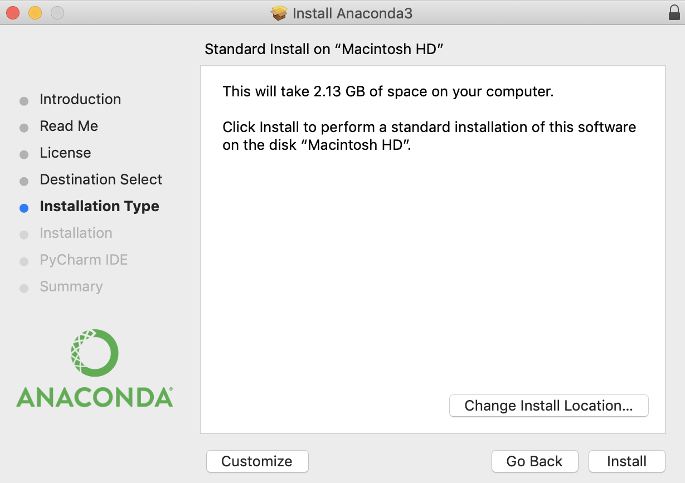
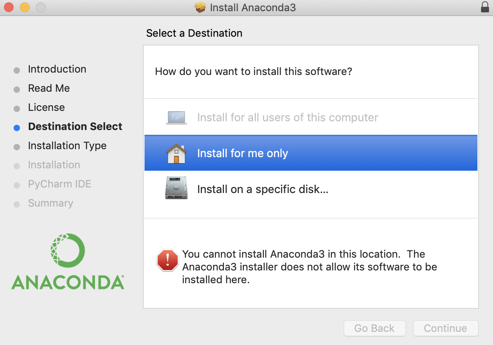
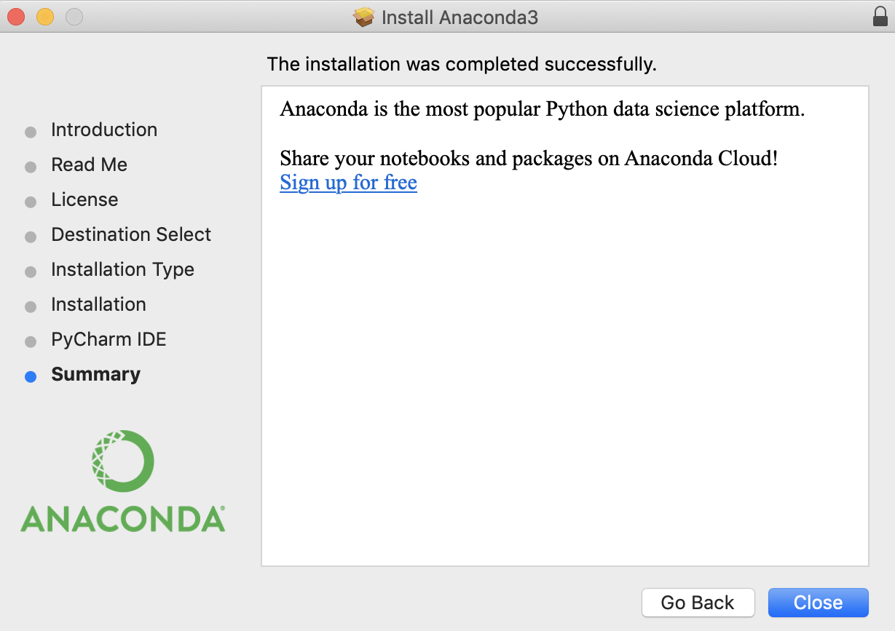
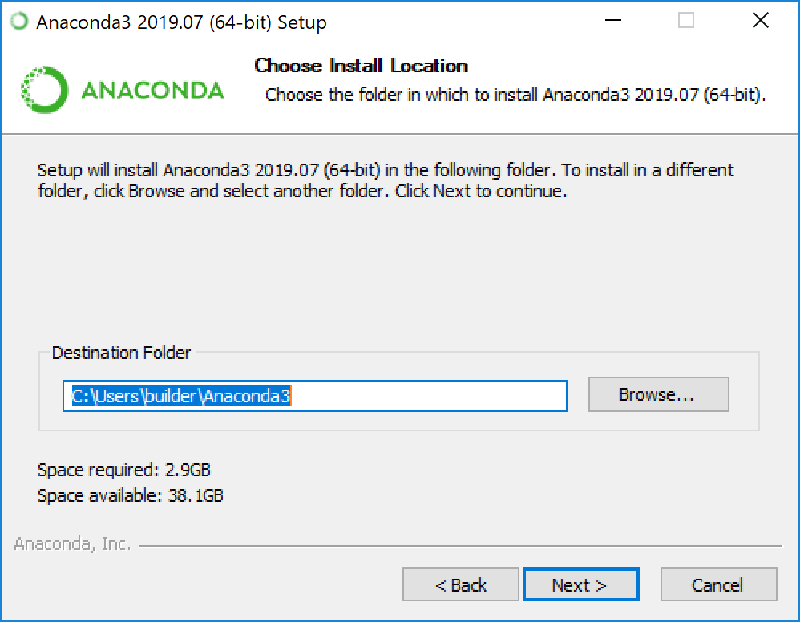
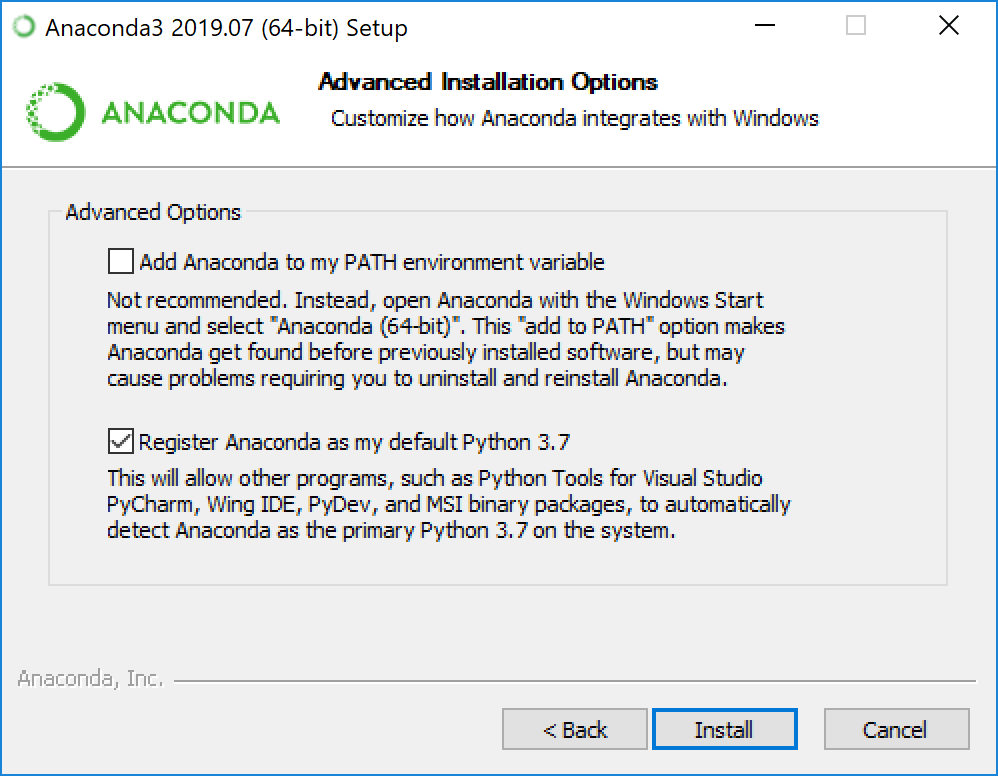
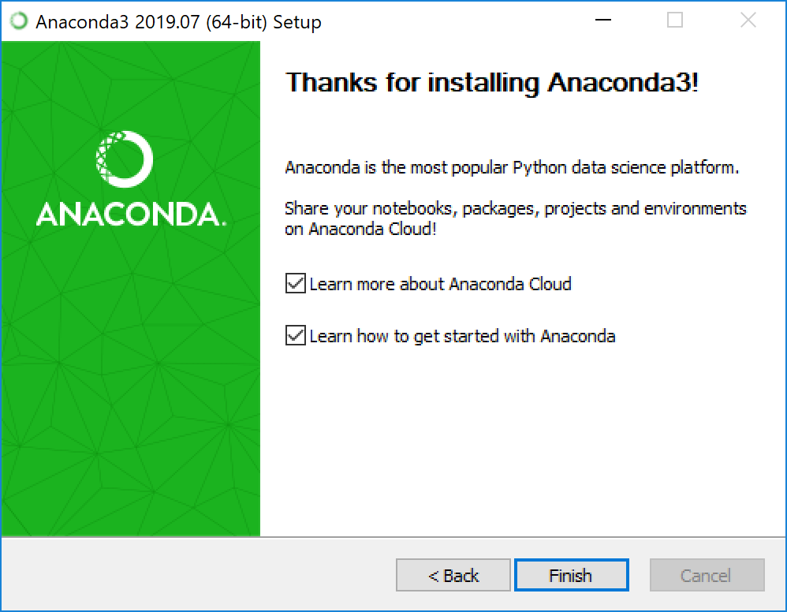

# Programming Fundamentals with Python
Workshop Materials for Programming Fundamentals with Python - [METRO Library Council](https://metro.org/) - 2020.02.25

This beginner-level class will address concepts foundational to all programming languages and provide an introduction to coding more generally using Python as its framework for learning. The class will begin with a brief discussion about why Python is useful and how it can be implemented into your workflow. Then, we’ll spend the remainder of the class using Python to learn about programming basics and best practices.

By the end of class, learners will be exposed to:

* Basic Syntax
* Data Types
* Variables
* Functions
* Arguments
* Logical Operations and Conditional Statements
* For Loops
* Python Libraries

Learners are not expected to have significant previous coding experience prior to attending. We will be using Jupyter Notebook and Anaconda. Please install [Anaconda](https://docs.anaconda.com/anaconda/install/) (which comes with Jupyter Notebook) prior to the workshop. If you have any problems with the installation, feel free to consult the link above or email me at genevieve [dot] milliken [at] gmail [dot] com. There are also step-by-step installation instructions below. 

---

# Anaconda Installation

- [MacOS](#MacOS)
- [Windows](#Windows)
- [Linux](#Linux)

# MacOS

1. Download the graphical [macOS installer](https://www.anaconda.com/distribution/#download-section) for Python 3.7.

2. Double-click the downloaded file and click continue to start the installation.

3. Answer the prompts on the Introduction, Read Me, and License screens.

4. Click the Install button to install Anaconda in your ~/opt directory (recommended).

5. Click the continue button.

6. OR, click the Change Install Location button to install in another location (not recommended) On the Destination Select screen, select Install for me only.

7. Click the continue button.

8. Optional: To install PyCharm for Anaconda, click on the link to https://www.anaconda.com/pycharm. Or install without.

9. A successful installation will display "The installation was completed successfully". [Verify Installation](https://docs.anaconda.com/anaconda/install/verify-install/).

# Windows

1. Download the Anaconda installer.

2. OPTIONAL: Verify data integrity with [SHA-256](https://docs.anaconda.com/anaconda/install/hashes/).

3. Double click the installer to launch.

4. Click Next.

5. Read the licensing terms and click “I Agree”.

6. Select an install for “Just Me” unless you’re installing for all users (which requires Windows Administrator privileges) and click Next.

7. Select a destination folder to install Anaconda and click the Next button. See [FAQ](https://docs.anaconda.com/anaconda/user-guide/faq/#distribution-faq-windows-folder).

8. Choose whether to add Anaconda to your PATH environment variable. We recommend not adding Anaconda to the PATH environment variable, since this can interfere with other software. Instead, use Anaconda software by opening Anaconda Navigator or the Anaconda Prompt from the Start Menu.

9. Choose whether to register Anaconda as your default Python. Unless you plan on installing and running multiple versions of Anaconda or multiple versions of Python, accept the default and leave this box checked.

10. Click the Install button. If you want to watch the packages Anaconda is installing, click Show Details.

11. Click the Next button.

12. Optional: To install PyCharm for Anaconda, click on the link to https://www.anaconda.com/pycharm. Or to install Anaconda without PyCharm, click the Next button.

13. After a successful installation you will see the “Thanks for installing Anaconda” dialog box:

# Linux 

1. In your browser, download the [Anaconda installer for Linux](https://www.anaconda.com/distribution/#linux) (Python 3.7 version).

2. OPTIONAL: Verify integrity with SHA-256 checksum:

`sha256sum /path/filename`

3. After fully downloaded (it may take a few minutes), enter the following to install Anaconda for Python 3.7:

`bash ~/Downloads/Anaconda3-2019.10-Linux-x86_64.sh`

4. The installer prompts “In order to continue the installation process, please review the license agreement.” Click Enter to view license terms.

5. Scroll to the bottom of the license terms and enter “Yes” to agree.

6. The installer prompts you to click Enter to accept the default install location. Click Enter.

7. The installer prompts “Do you wish the installer to initialize Anaconda3 by running conda init?” Enter “yes”.

8. The installer finishes and displays “Thank you for installing Anaconda<2 or 3>!”

9. (Optional) The installer provides a link to install PyCharm for Anaconda at https://www.anaconda.com/pycharm.

10. Close and open your terminal window for the installation to take effect, or you can enter the command source

`~/.bashrc`

11. To run conda from anywhere without having the base environment activated by default, use:

`conda init`

`conda config --set auto_activate_base False`

12. Launch Anaconda Navigator from terminal

`$ source ~/anaconda3/bin/activate root`

`$ anaconda-navigator`
